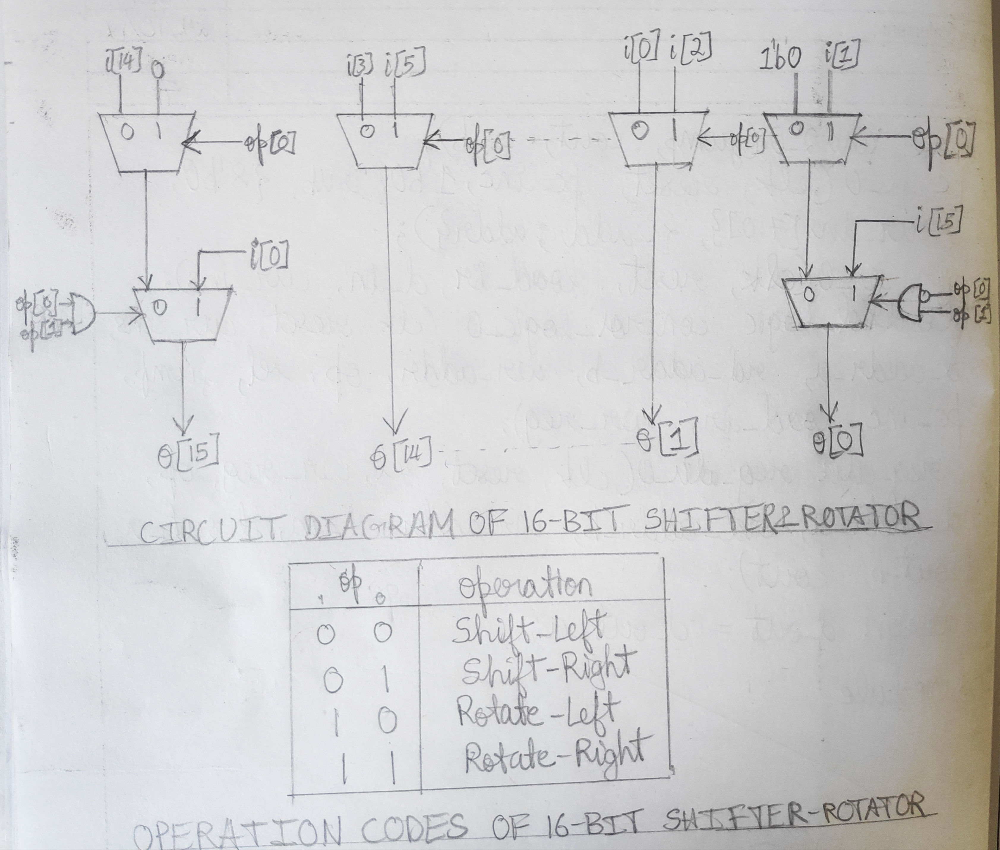

# Shift and rotate in ALU

3rd Sem DDCO Lab project - Design and implement shift–left, shift–right and rotate operations for the 16–bit ALU using multiplexers.

Excuse the module name :p

## Circuit Diagram and Table

